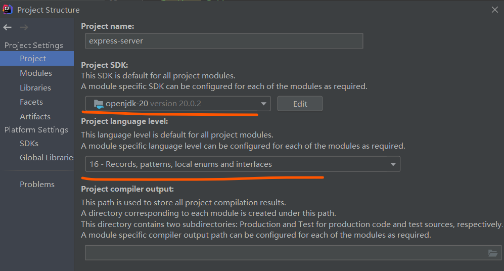

Springboot3 + Mybatis Plus + Security6 + JWT 一个简化的Security+JWT的登录认证

基于[SpringBoot-Vue-Template-Jwt
](https://github.com/itbaima-study/SpringBoot-Vue-Template-Jwt) 的后端进行一些修改 ，丢弃了一些功能，后续学习该项目时再补上

# 项目环境

- JDK17及以上

- Springboot 3

- idea 2021.3

项目运行前先

- 配置项目JDK：File->project structure



JDK17以上即可,

language level 16以上（如果没有16及以上，更新下idea）

- 导入数据库：sql/expressxxx.sql (创建数据库即表都在一个sql文件里)或 sql/expressxxx/ tablexxx.sql (分别创建表的sql文件)

- 启动redis：群文件 Redis-7.0.14-xxx.tar.gz 解压 并运行 redis-server.exe

# 目录结构说明

```java
-com.team24.security  //根目录
    - common 
        - AjaxResult    // 后端返回结果
        - xxx   // 其他全局公共属性
    - config // 配置
        - mp    // mybatis-plus 配置
        - redis // 暂时没有引入redis
        - security  // spring security 6 配置
            - filter    // 请求过滤器
            - userdetails   // 登录验证的UserDetails
            - EmployeePermissionEvaluator.java  // hasPermission 自定义验证
            - SecurityConfiguration.java    // security 配置类
        - swagger   // api 文档
    - controller    // 控制器
    - entity    // 实体类
        - dto   // 封装的一些数据传输对象DTO
    - mapper    // mybatis Mapper接口
    - service   // 业务服务及实现
    - util  // 工具类

- resources
    - mapper    // mybatis xml 数据库映射xml文件
    - application.yml   // 项目相关配置
```

# [Mybatis Plus](https://baomidou.com/)

## QueryWrapper写法

QueryWrapper查询一般在Service层实现

```java

@Service
public class EmployeeServiceImpl implements EmployeeService {
    @Resource
    EmployeeMapper employeeMapper;

    /**
     * QueryWrapper 写法
     */
    @Override
    public Employee selectByUsername(String username) {
        QueryWrapper<Employee> wrapper = new QueryWrapper<>();
        wrapper.eq("username", username);
        return employeeMapper.selectOne(wrapper);   // 找到具体的一个
    }

    /**
     * 利用传统 *Mapper.xml 的写法
     */
    @Override
    public Employee selectByCode(String code) {
        return employeeMapper.selectByCode(code);
    }
}
```

## 传统xml写法

在resources/mapper新建相应的*Mapper.xml文件，示例如下：

```xml
<?xml version="1.0" encoding="UTF-8"?>
<!DOCTYPE mapper PUBLIC "-//mybatis.org//DTD Mapper 3.0//EN" "<http://mybatis.org/dtd/mybatis-3-mapper.dtd>">
<mapper namespace="com.team24.express.mapper.EmployeeMapper">

    <!--    namespace 具体到自定义的Mapper接口，其余部分为固定模板-->
    <!--    在 mapper 代码块内编写 sql 操作-->
    <!--    id 应与 Mapper接口类种定义的方法名一致，且 resultType 为该接口方法的返回类型-->
    <select id="selectByCode" resultType="com.team24.express.entity.Employee">
        select * from employee
        <where>
            <if test="code !=null and code != ''">
                code = #{code}
            </if>
        </where>
    </select>

</mapper>

```

# JUnit

单元测试，可用来快速测试数据库操作是否正确。

新建的单元测试类位于 test/java/com/bobby/securityjwt/*Tests.java

例如EmployeeMapperTests测试类，该测试类种测试了 insert, select 等CRUD操作

```java

@SpringBootTest
public class EmployeeMapperTests {
    @Resource
    EmployeeMapper mapper;
    @Resource
    PasswordEncoder passwordEncoder;

    @Test
    public void insert() {
        Employee employee = new Employee();
        employee.setCode("sf8848");
        employee.setUsername("bobby");
        employee.setPassword(passwordEncoder.encode("123456"));
        employee.setName("黄准备");
        employee.setAccountStatus(0);   // normal
        employee.setCreateTime(LocalDateTime.now());
        org.junit.Assert.assertTrue(mapper.insert(employee) > 0);
    }

    @Test
    public void selectByCode() {
        String code = "sf8848";
        Employee employee = mapper.selectByCode(code);
        org.junit.Assert.assertNotNull(employee);
        System.out.println(employee);
    }
}
```

# Security 角色认证

预定义了 5 中角色，见common/RoleConst.java

```java
public final class RoleConst {
    public final static String SUPER_ADMIN = "ROLE_SUPER_ADMIN";    // 超级管理员
    public final static String STATION_ADMIN = "ROLE_STATION_ADMIN";    // 站点管理员
    public final static String DELIVERY_MAN = "ROLE_DELIVERY_MAN";  // 快递员
    public final static String EMPLOYEE = "ROLE_EMPLOYEE";  // 员工
    public static final String USER = "ROLE_USER";  //用户
}
```

## 使用

```java
    @PreAuthorize("hasAnyRole('SUPER_ADMIN','STATION_ADMIN')")
    @PostMapping("/delete")
    public AjaxResult delete(@RequestParam("id") Long id) {
        if (userService.deleteById(id))
            return AjaxResult.success("删除成功");
        else return AjaxResult.error("删除失败");
    }
```

使用@PreAuthorize("hasAnyRole('SUPER_ADMIN','STATION_ADMIN')")注解。

其中@hasAnyRole() 会在传入的字符串前加前缀 'ROLE_'，而@hasRole() 则不会。

因此若判断是否具有权限ROLE_SUPER_ADMIN，采用@hasAnyRole('SUPER_ADMIN')，而采用@hasRole('ROLE_SUPER_ADMIN')


使用该注解实现了在后端进行权限验证和拦截。

# OpenAPI

[示例]([SpringBoot集成Swagger3.0（详细） - 蚂蚁小哥 - 博客园](https://www.cnblogs.com/antLaddie/p/17418078.html#_label1_3:~:text=public%20class%20SwaggerOpenApiConfig%20%7B%0A%7D-,4%EF%BC%9A%E9%85%8D%E7%BD%AEAPI%E6%8E%A5%E5%8F%A3%E4%BF%A1%E6%81%AF%EF%BC%88%E6%B3%A8%E8%A7%A3%EF%BC%8C%E9%87%8D%E8%A6%81,-%EF%BC%89))

默认访问地址：http://localhost:8080/swagger-ui.html

采用API注解的方式，使前端人员方便查看后端API接口，便于开发。


